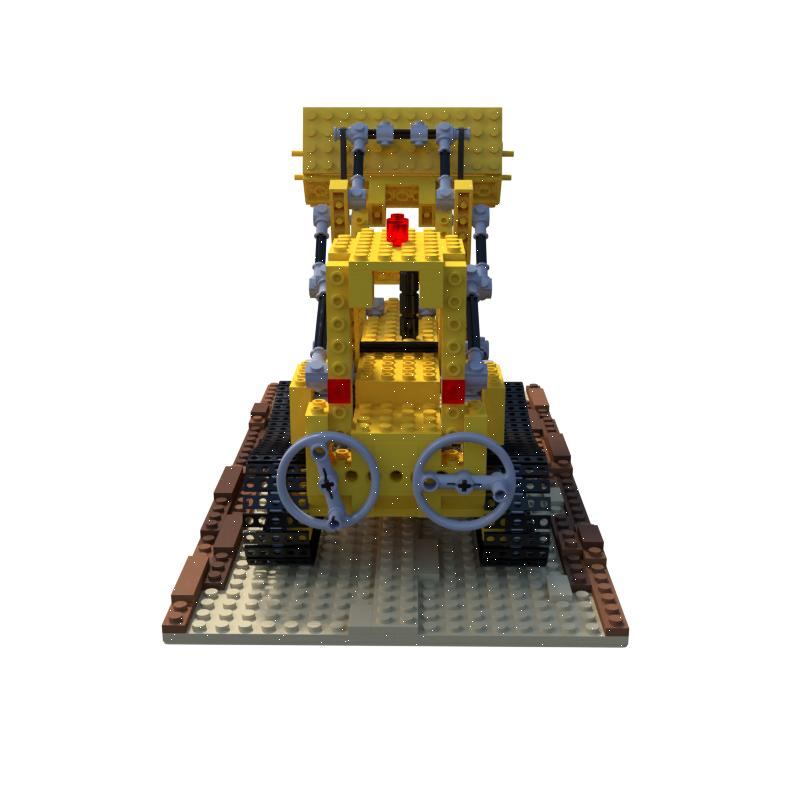
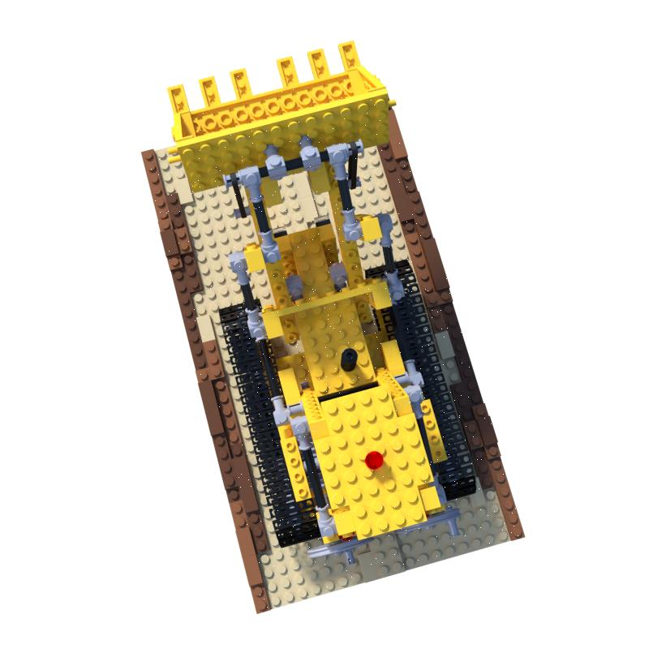

# NeRF-tiny

## Introduction

A simple pytorch implementation of NeRF

## Running Tips

Change your working directory to NeRF-tiny and run:
```
python3 main.py --conf=fern
```
for the llff's fern. Or run:
```
python3 main.py --conf=lego
```
To use other model, write configure files under directory `conf`.

## Results

Original:


Predict:



Original:


Predict:


